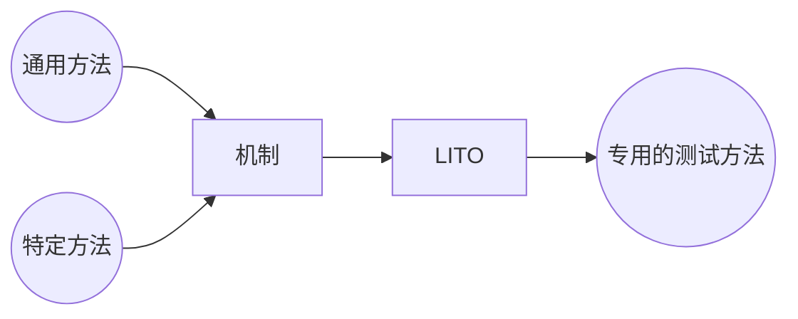
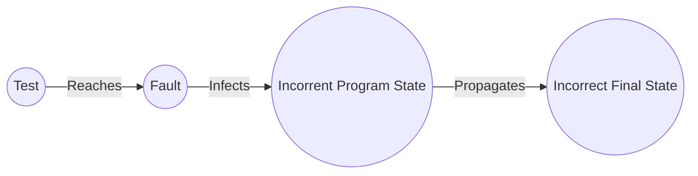
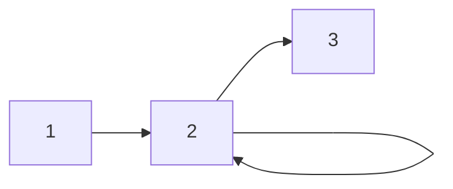
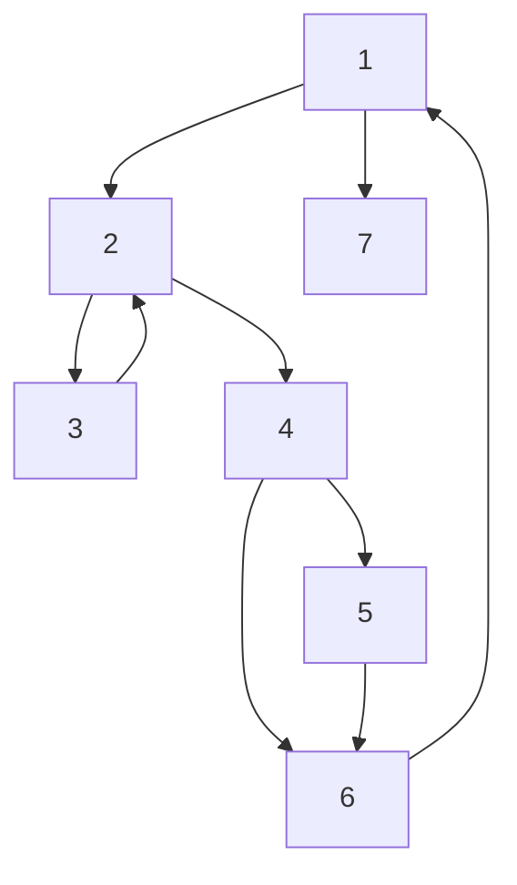
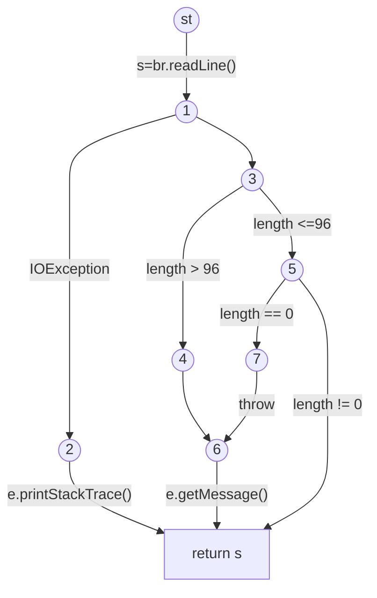

## 第一章 概述

### Failure, Fault和error

* 软件缺陷(fault)：软件中的一个静态缺陷

* 软件故障(failure)：与需求或预期行为的其他描述相关的外部、不正确的行为

* 软件错误(error)：一种错误的内部状态，是某些错误的表现 

> 以医生看病做比喻：
>
> 病人给医生一张症状表——failures
>
> 医生试图诊断根本原因，疾病——fault 
>
> 医生可能会发现异常的内部情况（高血压、心跳不规则、血流中有细菌）——error

### 产品规范

产品规范，有时简称为规范或产品规范，是软件开发团队之间的协议。

​	它定义了他们正在创建的产品，详细说明了它是什么，它将如何运作，它将做什么，以及它不会做什么。

​	**bug**是一个更宽泛的概念，指出现了不符合产品规格的错误。不建议使用bug描述软件的问题，而是要具体的用failure, fault, error描述。当软件出现了以下五种情况时，被称为出现了bug：

* 软件并没有做产品说明书上说它应该做的事情。

* 软件所做的事情是产品说明书上说它不应该做的。

* 软件做了一些产品规范中没有提到的事情。

* 软件没有做产品规范没有提到但应该做的事情。

*  软件很难理解，很难使用，速度很慢，或者在软件测试人员的眼里，最终用户会认为它是完全不正确的。 

### 软件测试的目的

#### Validation & Verification(IEEE提出 IV&V)

Validation (确认)：在软件开发结束时评估软件以确保符合预期用途的过程              

Verification(验证)：确定软件开发过程中给定阶段的产品是否满足前一阶段中建立的要求的过程

> 一个IV&V的案例：
>
> 1990年4月，哈勃太空望远镜被送入环绕地球的轨道。作为一个反射望远镜，哈勃望远镜使用一个大镜子作为它的主要手段来放大它瞄准的物体。
>
> 测试它的唯一方法是仔细测量它的所有属性，并将测量值与指定的值进行比较。这项测试已经完成，哈勃被宣布适合发射。不幸的是，在它投入使用后不久，它返回的图像被发现失去了焦点。              一项调查发现，这面镜子是不正当制造的。镜子是按规格磨光的，但规格不对。镜子非常精确，但并不精确。测试已确认镜像符合规范验证(verification)，但未确认其符合原始需求验证(validation)。1993年，一次航天飞机任务通过安装一个“校正透镜”来修复哈勃望远镜，以重新聚焦由不正确制造的反射镜产生的图像。              
>
> 虽然这不是一个软件示例，但是验证和确认同样适用于软件测试。千万不要认为规格是正确的。如果你验证了规范并验证了最终产品，你就可以避免像哈勃望远镜那样的问题。 

#### 另一种说法——五层理论

级别0: 测试和调试没有区别

级别1：测试的目的是显示正确性

级别2：测试的目的是为了显示软件不工作

级别3：测试的目的不是为了证明任何特定的东西，而是为了降低使用软件的风险

第4级：测试是一种智力训练，帮助所有IT专业人员开发更高质量的软件 

> Level0认为测试和调试没有区别，这是软件初学者常有的想法。这样的思维不区分程序中的错误行为和错误 ，对开发可靠或安全的软件没有帮助。Level1的缺陷在于，对于一定规模的软件来说，完全的正确是不可能达到的。而如果在测试中没有出现failure，我们就无法改进我们的软件；不会区分是好软件还是坏测试。测试工程师没有：严格的目标|实停规则|形式化测试技术|测试经理没有能力。Level2的目的是找出软件的failure，测试人员和开发人员立场是对立的，不利于团队协作

### 怎样做测试用例

必须记录书面测试目标和要求：

* 你的计划覆盖率是多少？哪些覆盖准则，分别关心的是哪些层面的东西...

* 多少测试就足够了？

* 共同目标-花费预算…测试期限… 

测试必须尽早进行，从需求阶段就开始测试的工作（需求文档的问题，通过文档设计测试用例）

软件测试的目标：尽早地消除faults，提高质量，减低成本，提高用户的满意度

### 测试活动

测试人员：测试工程师和测试管理里人员

**测试工程师的任务：**

* 设计测试输入

* 制造测试输入

* 运行测试用力

* 分析结果

* 向开发人员和管理人员反馈结果

**测试管理人员：**

* 管理测试团队

* 设定测试的目标、策略和过程 

#### 测试的五个层次

(Unit)单元测试——对单个的方法或者函数进行测试

(Module)模块测试——相关的方法和函数等一起进行测试

(Integration)集成测试——测试模块之间的相互影响

(System)系统测试——将整个软件作为一个完整的系统进行测试

(Acceptance)验收测试——软件团队对软件进行验收、

这种划分方法掩盖了潜在的相似之处 

对于**面向对象**的语言，则划分为方法，方法之间，类，类之间的测试

#### 不同的测试方法

黑盒测试：不知道软件代码的情况，根据软件的需求规格说明书，需求文档等生成测试用例

白盒测试：基于代码生成测试用例

基于模型的测试：把软件抽象成不同的模型，进而生成测试用例

### 嵌入式软件测试

​	与通用软件测试方法的不同之处：嵌入式软件测试不仅需要考虑软件本身，还需要考虑和硬件部件的紧密关系，通常是条件苛刻的时间约束和实时要求，以及其他与性能相关的关系。

#### 结构化测试四要素LITO

* Lifecycle：做什么、什么时候做（What, when）

* Technique：如何做（how）

* Infrastructure：测试环境、工具

* Organization：谁去做（who）

**嵌入式软件测试的目的和软件测试一样**，但是

* 嵌入式系统的多样性导致其测试上的巨大差异

* 每种嵌入式系统都有其特有的测试方法

* 即使没有通用的嵌入式测试方法，但是存在必须满足的基本测试原理



#### 开发过程：多V模型

分别从模型，原型，产品三个阶段开始软件测试的开发

​	每个阶段又包含设计、开发、测试三个阶段

​	模型阶段：文档审查、代码分析（读静态代码）、模型检查：状态转换测试、稀有事件测试、模拟

​	原型阶段：需求确认、设计确认、主机-目标机测试、软件的验收测试、软硬件系统集成测试、回归测试

​	产品阶段：主要是验收和回归测试

### MDTD 模型驱动的测试设计

​	**Test Design**指是设计测试软件的测试用例。测试设计是软件测试过程中最重要的环节，没有设计用例的话测试是无法开展的。

四种测试活动：

* 测试设计，其中测试设计又分为两种：Criteria-based(基于标准，依据计算机知识)和Human-based(基于指标，领域知识)
* 测试自动化
* 测试执行
* 测试评估

#### 基于标准的测试设计

这是软件测试中最专业的工作，针对相应的覆盖标准设计测试用例

需要了解：

离散数学

程序设计的基础

需要很多传统的计算机科学学位

使用不具备设计测试资格的人员很容易出现无效测试

#### 以人为本的测试设计

基于程序领域知识和测试人类知识的设计测试值

​	从用户体验来进行设计，关于某一个其他专业领域，例如法律，心理等方面，这不需要专业的计算机知识

#### 测试自动化(Test Automation)

​	需要用自动化测试工具编写测试脚本，需要一定的编程技能(不是特别深入的编程技巧)；注意在写脚本的时候要明白期望的输出（由测试设计人员或测试评估人员指出）

#### 测试执行(Test Execution)

​	运行测试并得到结果，这是对要求最低的一步，只需要很基础的计算机技能。最需要注意的是要详细的记录测试的结果。

#### 测试评价(Test Evaluation)

​	通常由具有领域知识的人来从事

#### 更多其它的测试活动

> 测试管理：设置策略，组织团队，与开发接口，选择标准，决定需要多少自动化…
>
> 测试维护：随着软件的发展，保存测试以供重用
>
> ​	需要测试设计者和自动化者的合作.决定何时修剪测试套件一部分是策略性的，一部分是技术性的——总的来说，这非常困难！
>
> 测试文件：各方参与
>
> ​	每个测试必须记录“为什么”-满足的标准和测试要求或人为设计测试的基本原理；确保整个过程的可追溯性；在自动化测试中保存文档 

### 模型驱动的测试模型

软件开发的产物(需求文档、设计文档、软件开发说明书)→抽象建模→输入→测试用例→测试脚本→测试结果→测试评价(pass/fail)


### 软件测试的基础

​	**测试只能表明failure的存在，不能说明failure不存在**

#### 测试和调试(Testing&Debugging)

Testing：通过观察软件的执行过程对软甲进行评价

Debugging：看见软件产生了failure，再去找软件中的fault

#### Fault & Failure模型(RIPR)

Reachability可达性：Fault产生的位置一定要被运行到

Infection：程序产生了错误状态

Propagation传播：程序的错误状态导致了输出或最终状态的错误

Reveal可揭露：测试人员可以发现错误状态发生的位置



#### 可测试性

​	The degree to which a system or component facilitates the establishment of test criteria and the performance of tests to determine whether those criteria have been met

​	简单地说，指软件错误容易发现的程度。一般用**能否给出容易的给出输入和观察输出**来衡量

​	Observability 观察程序的**输出**、对环境的影响以及其他硬件和软件组件的行为有多容易

​	Controllability 在值、操作和行为方面为程序提供所需的**输入**是多么容易

#### 测试用例的内容

Prefix values 前置值：为了让测试用例的输入能够被软件接受应该输入的值

Postfix values后置值：为了让测试结果能够被观测到应该输入的值

* Test case

  ​	包含测试用例的值、前置值、后置值、期望输出

* Test set 一系列的测试用例

* Executable test script 产生failure后执行的脚本

### 基于标准的测试设计

#### 覆盖的标准

对所有的可能情况都进行测试是不现实的（例如一个整型都有21亿的输入空间）

​	→因此要选用合理的标准对所有情况进行覆盖

覆盖标准的优点：

* 最大化“物有所值”
* 提供从软件到测试的可追溯性
* 简化回归测试
* 给测试人员一个“停止规则”
* 可以很好的支持强大的工具

Test Criterion 测试标准: 定义测试需求的规则和规程的集合

- 覆盖每一个声明
- 覆盖所有功能

Test Requirements 测试需求:测试期间必须满足或覆盖的特定内容。每个语句或每个功能可能是一个测试需求。

四种结构：输入域(input domains)、逻辑表达式(logic expressions)、图(graphs)、语法描述(syntax descriptions)

## 第二章 图覆盖

图覆盖是软件测试中最常见的结构

图的形式有：

* Control flow graphs
* Design structure
* FSMs and statecharts
* Use cases

测试通常是为了“覆盖”图形中的某个路径。

### 2.1 图的结构

* 一个图由节点和边构成

* N表示图中所有节点的集合，**N不为空**
* N<sub>0</sub>表示图的起始节点，它是N的子集
* N<sub>f</sub>表示图的终止节点，它也是N的子集
* E代表边，E$\subseteq$N×N，每个边从一个节点连接到另一个节点，用(p,q)表示

#### 路径(Path)

路径是图中的一个节点序列，路径经过的边数被称为路径的长度(length)。特别的，路径的节点可以为一个，此时路径的长度为0。

**子路径**：路径对应的节点序列的子序列

**测试路径**：要求从图的起始节点出发，到终止节点结束

某些测试路径可以被许多测试执行，而有的测试路径不能被测试用例执行。

SESE graph **单入单出图**

#### 访问和游历(Visiting and Touring)

**访问**：若测试路径包含了节点p，则称测试访问了p；对边也有类似的定义。

**游历**：若一个路径m是另一个路径n的子路径，则称n游历了m。


* 一般我们用**path(t)**表示测试用例t所经过的路径
* 用**path(T)**表示测试集合T所经过的路径集合
* 每个测试仅包含一个测试路径

**侧访游历sidetrips**：一个测试路径因为分叉不能到达的TR被称为该测试路径的sidetrip

**可达(reach)**：可以从n到达的子图

​	如果存在从ni到n的路径，则在语法上可以从节点ni到达节点n。

​	语法上：图中存在子路径

​	语义上：存在一个可以执行该子路径的测试

**语法上的可达不一定说明语义上可达**

### 2.2 在测试中使用图

1. 用图为软件开发一个模型
2. 需要测试访问或访问特定的节点、边或子路径

一些相关的术语

* Test Requirements 测试需求：描述测试路径的特性。
* Test Criterion 测试标准：定义测试需求的规则。
* Satisfaction 满意度：给定一组测试需求TR的测试标准C，当且仅当对于一个测试要求TR，都有一个满足它的测试路径在path(T)中，则称这样的测试集合T满足C。
* Structural Coverage Criterion 结构覆盖标准
* Data Flow Coverage Criteria 数据流覆盖标准

#### 点覆盖和边覆盖

这两个标准可以理解为测试集合包含了图中的每一个点和每一条边。

**点覆盖(NC)**：TR包含了图中每一个可达的节点。

**边覆盖(EC)**：TR包含了图中每一个路径长度不超过1的可达路径

**点覆盖和边覆盖的区别**：当两个节点间存在一条边和其它的子路径时，NC和EC是不相同的。

边对覆盖(Edge-Pair Coverage)：TR包含了每一个长度不超过2的可达路径

完全路径覆盖(Complete Path Coverage)：TR包含了图G中的所有路径

CPC的实现是不可能的，当图中出现环时，无法找出所有的路径

指定路径覆盖(Specified Path Coverage)：TR包含一个测试路径集合S，而S是一个参数

#### 解决环的问题：主路径(prime path)

简单路径：简单路径的内部不包含环

主路径：主路径是最长的简单路径

主路径覆盖(Prime Path Coverage)：TR中包含图G中的所有主路径

主路径覆盖可以包含点覆盖、边覆盖，但不包含边对覆盖。例如：



---

作业题



(b) TR = {(1,2,3), (1,2,4), (2,3,2), (2,4,5), (2,4,6), (3,2,3),

 (3,2,4), (4,5,6), (4,6,1), (5,6,1), (6,1,7), (6,1,2)}

(c) 不满足对边覆盖，缺少(3,2,3)和(6,1,2)

(d) 测试路径没有游历这个简单路径

(e) 点覆盖:{1,2,3,4,5,6,7}

边覆盖:{(1, 2), (1, 7), (2, 3), (2, 4), (3, 2), (4, 5), (4, 6), (5, 6), (6, 1)}

主路路径覆盖:{(1,7), (1,2,3), (1,2,4,5,6), (1,2,4,6), (3,2,4,5,6,1,7), (3,2,4,6,1,7), (3,2,3), (2,3,2)}

(f) Test Paths = [1,7], [2,3], [2,4,5,6]

(g) Test Paths = [1,2,3] [3,2] [1,2,4,5,6,1,7] [4,6]

----

### 2.3 图覆盖与源代码

#### 2.3.1控制流图(Control Flow Graphs)

CFG通过描述控制结构对方法的所有执行进行建模

* 节点：语句或语句序列（基本块）

* 边：控制传递

* 基本块：如果执行第一条语句，所有语句（没有分支）都在一个基本快

* 循环：在CFG中往往需要增加一些控制节点

控制流图有时还会提供一些额外信息，如分支预判断、定义、使用

#### 2.3.2 画控制流图

##### if语句的控制流图

```java
if(x<y)
{
    y = 0;
    x = x + 1;
}
else
{
    x = y;
}
```

对应的控制流图为

```flow
st=>start: 开始
e=>end: 结束
op1=>operation: y = 0; x = x+1
op2=>operation: x = y
cond=>condition: x<y?

st->cond
cond(yes)->op1
cond(no)->op2
op1->e
op2->e
```

*一定要有起始节点和终止节点*

##### while语句数据控制图

```java
x = 0;
while(x < y)
{
    y = f(x, y);
    x = x + 1;
}
```

```flow
st=>start: 开始
end=>end: 结束
1=>operation: x = 0
2=>condition: x < y
3=>operation: y=f(x,y);x=x+1
st->1->2
2(yes,right)->3
3(top)->2
2(no)->end
```

在表示循环时，需要用一个状态来表示循环的入口，在上图中即为`x<y`判断块，这被称为dummy node

##### for语句的控制流图

```java
for(x = 0; x < y; x++)
{
    y = f(x, y);
}
```

```flow
start=>start: 开始
1=>operation: x=0
2=>condition: x<y
3=>operation: y=f(x,y)
4=>operation: x=x+1
end=>end: 5
start->1->2(yes)->3(right)->4(right)->2
2(no,bottom)->end
```

##### try-catch语句的控制流图

```java
try
{
   s = br.readLine();
   if (s.length() > 96)
      throw new Exception
         (“too long”);
   if (s.length() == 0)
      throw new Exception
         (“too short”);
} (catch IOException e) {
   e.printStackTrace();
} (catch Exception e) {
   e.getMessage();
}
return (s);
```



---

#### 从控制流图到测试路径

> 课堂示例
>
> 有下图的控制流图
>
> ```mermaid
> graph LR
> st((st))-->1((1))
> 1-->2((2))
> 2-->3((3))
> 3-->4((4))
> 3-->5((5))
> 4-->3
> 5-->6((6))
> 6-->7((7))
> 7-->6
> 6-->8((8))
> ```
>
> 它满足主路径覆盖的测试需求和测试路径为？
>
> TR
>
> A. [ 3, 4, 3 ]					B. [ 4, 3, 4 ]
>
> C. [ 7, 6, 7 ]					D. [ 7, 6, 8 ]
>
> E. [ 6, 7, 6 ]					F. [ 1, 2, 3, 4 ]
>
> G. [ 4, 3, 5, 6, 7 ]			H. [ 4, 3, 5, 6, 8 ]
>
> I. [ 1, 2, 3, 5, 6, 7 ]		J. [ 1, 2, 3, 5, 6, 8 ]
>
> Test Paths
>
> i.  [ 1, 2, 3, 4, 3, 5, 6, 7, 6, 8 ]
>
> ii. [ 1, 2, 3, 4, 3, 4, 3, 5, 6, 7, 6, 7, 6, 8 ]
>
> iii. [ 1, 2, 3, 4, 3, 5, 6, 8 ]
>
> iv. [ 1, 2, 3, 5, 6, 7, 6, 8 ]
>
> v.  [ 1, 2, 3, 5, 6, 8 ]
>
> | TP   |     TRs toured      | sidetrip |
> | ---- | :-----------------: | -------- |
> | i    |    A, D, E, F, G    | H, I, J  |
> | ii   | A, B, C, D, E, F, G | H, I, J  |
> | iii  |       A, F, H       | J        |
> | iv   |     D, E, F, I      | J        |
> | v    |          J          |          |
>
> 在上表中，由于测试路径ii中包含了测试用例i中所有游历的测试需求，所以i是多余的测试路径
>
> 测试需求尽量是直接游历，只有路径不能满足测试需求时，再考虑侧访游历

